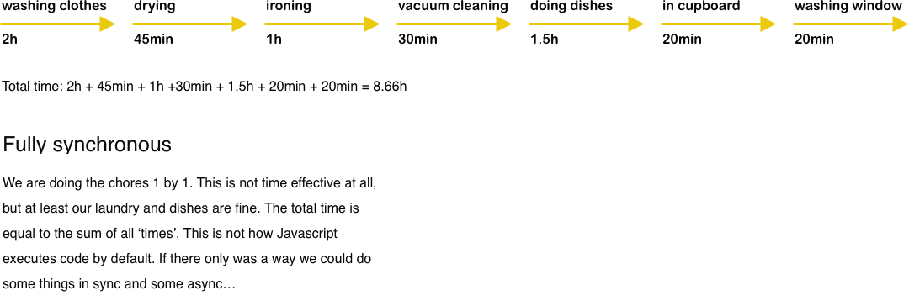
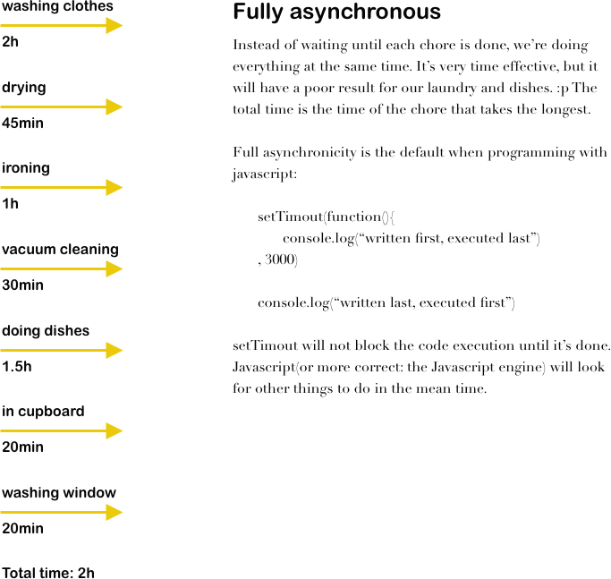
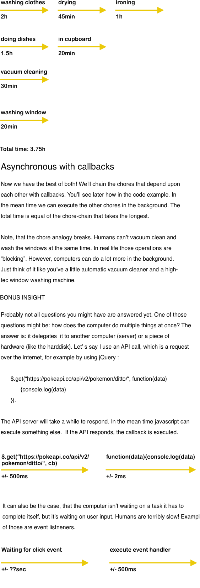

## Asynchronicity in Javascript

This is an extra resource with example code and a exercise to get you more familiar with the asynchronicity of javascript. All code by default is asynchronous in Javascript. That means, that <strong>code is not necessarily executed in the order you write it</strong>. In case a function takes a while to finish, it will look for something else to execute and will get back to it later. In general this is great! It speeds up the code execution a lot. However, sometimes you do not want this behaviour, because a certain function has to finish before the other one starts. In that case you need to tell javascript that code depends on other code. Modern javascript provides 3 ways of doing that:

  * callbacks
  * promises
  * async/await

For now we're going only to focus on callbacks. We'll get to promises in another lesson.

Think of the following analogy: It's Sunday and on Sunday's you do a lot of 
boring chores, like: 

*   washing your clothes (takes 2000ms)
*   hanging them out to dry (450ms)
*   ironing them (1000ms)
*   vacuum cleaning (500ms)
*   putting the dishes into the dishwasher (1500ms)
*   putting them in the cupboards (200ms)
*   cleaning windows (200ms)

Do all tasks depend upon each other? Which do and which do not? 

Some tasks you can execute simultaneously. I would be pretty dumb to stand in front of the dishwasher until it finished instead of moving on to some other chore in the meantime. Let's say you are that dumb an you do every chore 
synchronously. That would look like this:



By default code in javascript is executed asynchronous. That looks like this:



There's a function in javacript that can imitate asynchronous code. It's called setTimeout. Settimeout executes a function after a certain amount of miliseconds. We can use this to imitate functions that really take some time to complete. First we're going to use setTimout to simulate the chores with code fully asynchronous. A lot will go wrong! Afterwards, we'll do it the proper way with callbacks. Copy paste the following code and execute it:

``` javascript
var washingClothes = function() {
    setTimeout(function() {
        console.log("Washing clothes done!")
    }, 2000)
}

var dryingClothes = function(){
    setTimeout(function() {
        console.log("Hanging them out to dry done!")
    }, 450)
}

var ironing = function() {
    setTimeout(function() {
        console.log("Ironing done!")
    }, 1000)
}

var vacuumCleaning = function(){
    setTimeout(function() {
        console.log("Vacuum cleaning done!")
    }, 500)
}

var dishWasher = function() {
    setTimeout(function() {
        console.log("Putting the dishes into the dishwasher done!")
    }, 1500)
}

var inCupboards = function() {
    setTimeout(function() {
        console.log("Putting dishes in cupboard done!")
    }, 200)
}

var washingWindows = function() {
    setTimeout(function() {
        console.log("washing windows done!")
    }, 200)
}

washingClothes()
dryingClothes()
ironing()
vacuumCleaning()
dishWasher()
inCupboards()
washingWindows()

```

Oh oh! What a terrible mess. Try it with callbacks instead! Underneath, we've redefined the functions that need to be executed before another. The function (or chore) that can only be executed after these are finished will be pased to these functions as arguments. A function that is passed to another function in order for the higher order function to execute it when it's done, is called a callback function. We've also uncommented the previous function calls.

``` javascript

// washingClothes()
// dryingClothes()
// ironing()
// vacuumCleaning()
// dishWasher()
// inCupboards()
// washingWindows()

washingClothes = function(cb1, cb2) {
    setTimeout(function() {
        console.log("Washing clothes done!")
        cb1(cb2)
    }, 2000)
}

dryingClothes = function(cb){
    setTimeout(function() {
        console.log("Hanging them out to dry done!")
        cb()
    }, 450)
}

dishWasher = function(cb) {
    setTimeout(function() {
        console.log("Putting the dishes into the dishwasher done!")
        cb()
    }, 1500)
}

washingClothes(dryingClothes, ironing)
vacuumCleaning()
dishWasher(inCupboards)
washingWindows()

```

Finally, our laundry and dishes are handled like they are supposed to. :) Now this is happening: 



Now it's up to you! It's the end of the year and you have a lot of tasks to do, like:

* filing tax return (5000ms)
* transfering the taxes due (500ms)
* finding a new apartment (2000ms)
* moving out (500ms)
* moving in (500ms)
* redocorating the new apartment (1000s)
* answering emails (500ms)

Write functions for these tasks that use callbacks. Make use of setTimeout to imitate code that really takes some time to finish. You don't want to move out before you found a new apartment or otherwhise you'll be homeless. You also don't wan't to transfer your taxes before you know what to transfer. Good luck!
  